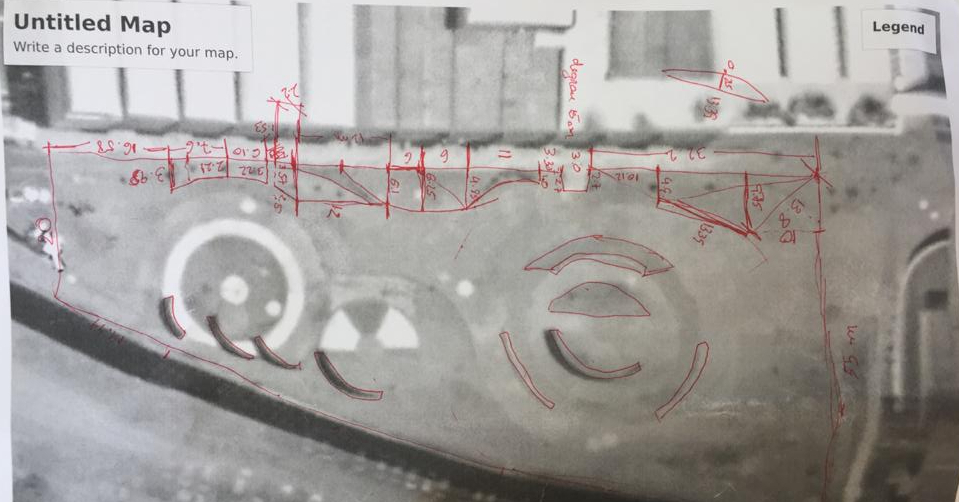
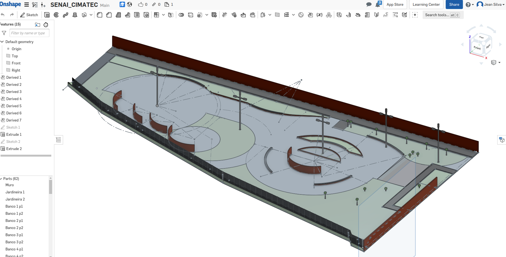

# Yellow Ball Challenge

Find a yellow ball inside a world build to simulate the external area of SENAI/CIMATEC 4 using an autonomous robot.

## 1. Installation

In this creation challenge, I used a ROS distribution called melodic, since my operation system is Linux Ubuntu 18.04. You can probably change the "melodic" word in the terminal lines to your distribution, but it's recommended to check the source guide in the references tab.

It's recommended to type these in your terminal before the installation:

`$ sudo apt-get update`

`$ sudo apt-get upgrade`

### 1.1. Husky Packages

`$ sudo apt-get install ros-melodic-husky-*`

### 1.2. nav2d Packages

`$ sudo apt-get install ros-melodic-nav2d`

### 1.3. Additional Packages

There are another packages used in this workspace that are downloaded as you clone the repository. There are Velodyne V-16 Package and PointCloud to LaserScan Package. Both are referenced in the their respective topic.

## 2. Launching files

This application is executed in two terminals.

### In the first terminal, type:

`$ roslaunch cimatec4_gazebo gazebo.launch`

When you see a log similar to this in your terminal, it means that your Gazebo and RViz are good for work purposes:

```
(...)
[ INFO] [1580825531.610236640, 0.121000000]: global_costmap: Using plugin "static"
[ INFO] [1580825531.619084052, 0.123000000]: Requesting the map...
Laser Pose= 0.0812001 -2.14758e-07 -2.6448e-06
[ INFO] [1580825532.123695659, 0.199000000]: Creating 1 swatches
[ INFO] [1580825532.169870339, 0.202000000]: Creating 1 swatches
[ INFO] [1580825532.354322764, 0.226000000]: Resizing costmap to 4000 X 4000 at 0.050000 m/pix
[ INFO] [1580825533.052063949, 0.323000000]: Received a 4000 X 4000 map at 0.050000 m/pix
[ INFO] [1580825533.052104549, 0.323000000]: Subscribing to updates
[ INFO] [1580825533.055465291, 0.323000000]: global_costmap: Using plugin "inflation"
[ INFO] [1580825533.120548727, 0.333000000]: local_costmap: Using plugin "obstacles_laser"
[ INFO] [1580825533.124382321, 0.333000000]:     Subscribed to Topics: laser
[ INFO] [1580825533.137823511, 0.335000000]: local_costmap: Using plugin "inflation"
[ INFO] [1580825533.173461642, 0.340000000]: Created local_planner dwa_local_planner/DWAPlannerROS
[ INFO] [1580825533.179398998, 0.341000000]: Sim period is set to 0.20
[ WARN] [1580825533.183486205, 0.341000000]: Parameter max_trans_vel is deprecated (and will not load properly). Use max_vel_trans instead.
[ WARN] [1580825533.184080755, 0.341000000]: Parameter min_trans_vel is deprecated (and will not load properly). Use min_vel_trans instead.
[ WARN] [1580825533.184390707, 0.342000000]: Parameter max_rot_vel is deprecated (and will not load properly). Use max_vel_theta instead.
[ WARN] [1580825533.184638985, 0.342000000]: Parameter min_rot_vel is deprecated (and will not load properly). Use min_vel_theta instead.
[ WARN] [1580825534.251806813, 0.502000000]: Interactive marker 'robot_twist_marker' contains unnormalized quaternions. This warning will only be output once but may be true for others; enable DEBUG messages for ros.rviz.quaternions to see more details.
[ INFO] [1580825534.859703668, 0.593000000]: Creating 1 swatches
[ INFO] [1580825535.129362236, 0.628000000]: Recovery behavior will clear layer 'obstacles'
[ INFO] [1580825535.144767642, 0.629000000]: Recovery behavior will clear layer 'obstacles'
[ INFO] [1580825535.202948908, 0.638000000]: Creating 1 swatches
(...)
```

And after that you can follow the Laser information in the same terminal:

```
(...)
Laser Pose= 0.0812062 -2.64174e-07 -3.25313e-06
Registering Scans:Done
Laser Pose= 0.081212 -2.64741e-07 -3.25988e-06
Registering Scans:Done
Laser Pose= 0.0812178 -2.66822e-07 -3.28527e-06
Registering Scans:Done
Laser Pose= 0.0812237 -2.6542e-07 -3.26777e-06
Registering Scans:Done
Laser Pose= 0.0812298 -2.6648e-07 -3.28058e-06
Registering Scans:Done
Laser Pose= 0.0812359 -2.705e-07 -3.32984e-06
Registering Scans:Done
Laser Pose= 0.0812418 -2.74378e-07 -3.37736e-06
Registering Scans:Done
Laser Pose= 0.0812477 -2.75625e-07 -3.39247e-06
Registering Scans:Done
Laser Pose= 0.0812538 -2.72144e-07 -3.34934e-06
Registering Scans:Done
Laser Pose= 0.0812597 -2.73727e-07 -3.36859e-06
Registering Scans:Done
Laser Pose= 0.0812659 -2.77225e-07 -3.41142e-06
Registering Scans:Done
(...)
```

### After that, in the second terminal, type:

`$ rosrun cimatec4_gazebo mission.py`

Then, it's going to map, navigate, and search the yellow ball in the map.

## 2. Methodology

### 2.1. Measure the world

The first thing to do is measure the world we're going to build. In this case, I'm using a satellite picture from Google Earth software of the area and I visited the area multiple times with a desired measure tool. These are the pictures of the process:




### 2.2. Build the world as a model file

Using a CAD software (in this case OnShape), we build the external area and save as a Collada file (.dae). Remember to assign values of color and material.



If you are interest in a more detailed tutorial about this world you can find in this link:

### 2.3. Use an autonomous robot to navigate the area (Husky)


## . References

### .1. Softwares

* [ROS Framework - Melodic Distribution](http://wiki.ros.org/) - This framework includes [Gazebo](http://gazebosim.org/) and [RViz](http://wiki.ros.org/rviz).

* [OnShape](https://onshape.com)

### .2. Packages

* [Simulating Husky](https://www.clearpathrobotics.com/assets/guides/husky/SimulatingHusky.html)

* [PointCloud to LaserScan](http://wiki.ros.org/pointcloud_to_laserscan)

* [Velodyne Simulation and Plugins](https://bitbucket.org/DataspeedInc/velodyne_simulator/src/master/)

* [nav2d](http://wiki.ros.org/nav2d/)

### .3. Knowledge references

* [OpenCV with ROS using Python](https://dabit-industries.github.io/turtlebot2-tutorials/14b-OpenCV2_Python.html)

* [Detecting Circles in Images using OpenCV and Hough Circles](https://www.pyimagesearch.com/2014/07/21/detecting-circles-images-using-opencv-hough-circles/)

* [Detecting circular shapes using contours](http://layer0.authentise.com/detecting-circular-shapes-using-contours.html)


